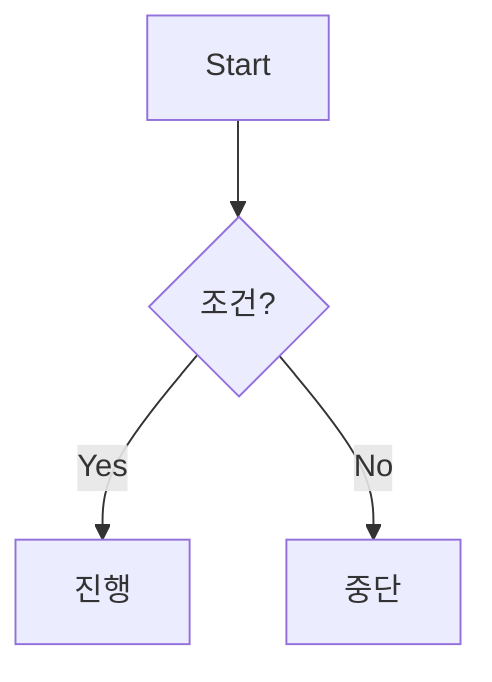

<details>
<summary><strong>요약(클릭)</strong> — 이 문서는 블로그 마크다운 렌더러를 한 번에 점검하기 위한 <em>종합 샘플</em>입니다.</summary>

- GFM 확장: 표, 체크박스, 취소선, 각주, 자동 링크 등
- 수식(KaTeX/MathJax), Mermaid 다이어그램, HTML 섹션, Definition List 등
- 내부/외부 링크, 이미지, 앵커, 코드 하이라이트, 인용문, 목록, 표 정렬

</details>

[맨 아래로 이동](#끝)

---

## 목차 (수동)

1. [제목 레벨](#제목-레벨)
2. [텍스트 스타일](#텍스트-스타일)
3. [줄바꿈 & 수평선](#줄바꿈--수평선)
4. [인용문](#인용문)
5. [목록](#목록)
6. [코드](#코드)
7. [표(Table)](#표table)
8. [링크](#링크)
9. [이미지](#이미지)
10. [각주](#각주)
11. [수식(Math)](#수식math)
12. [HTML 요소](#htm로-요소)
13. [이스케이프](#이스케이프)
14. [정의 목록(Definition List)](#정의-목록definition-list)
15. [혼합 예제](#혼합-예제)
16. [렌더러 특이점 테스트](#렌더러-특이점-테스트)
17. [끝](#끝)

---

## 제목 레벨

# H1 제목

## H2 제목

### H3 제목

#### H4 제목

##### H5 제목

###### H6 제목

---

## 텍스트 스타일

일반 문장, _이탤릭_ / _이탤릭_, **볼드**, **볼드**, **_볼드+이탤릭_**, ~~취소선~~, <u>밑줄(HTML)</u>, <mark>형광(HTML)</mark>, <sup>윗첨자</sup>, <sub>아랫첨자</sub>, `인라인 코드`.

따옴표 테스트: 'single' "double" “smart” ‘quotes’.
이모지 & 단축 코드: \:tada: \:rocket: \:sparkles:

인라인 백틱 안에 백틱: ``코드 안에 `백틱` 포함``

문장 끝 공백 두 칸으로<br>강제 줄바꿈 테스트.

---

## 줄바꿈 & 수평선

문단 사이 빈 줄 = 새 단락.

수평선(세 가지):

---

---

---

---

## 인용문

> 최상위 인용문입니다.
>
> > 중첩 인용문입니다.
> >
> > - 중첩 안의 목록 1
> > - 중첩 안의 목록 2
>
> 인용문 안에 **강조**와 `코드`도 됩니다.

---

## 목록

### 비순서 목록 (기호 다양성)

- 하이픈 항목 A
- 하이픈 항목 B
  - 하위 항목 B-1
  - 하위 항목 B-2

* 별표 항목 C
* 별표 항목 D

- 플러스 항목 E
- 플러스 항목 F

### 순서 목록

1. 첫 번째
2. 두 번째
3. 세 번째

숫자 리터럴을 유지하려면(렌더러 따라 다름):

<ol start="7">
  <li>일곱 번째</li>
  <li>여덟 번째</li>
</ol>

### 체크리스트 (GFM)

- [ ] 할 일 1
- [x] 완료된 일 2
  - [ ] 하위 작업 2-1
  - [x] 하위 작업 2-2

---

## 코드

인라인은 앞서 사용했고, 이제 펜스드 코드 블록들:

```bash
# Bash
set -euo pipefail
NAME="world"
echo "Hello, ${NAME}!"
```

```javascript
// JavaScript
export function sum(a, b) {
  return a + b;
}
console.log(sum(2, 3));
```

```typescript
// TypeScript
type User = { id: number; name: string };
const u: User = { id: 1, name: "Kim" };
```

```tsx
// React (TSX)
export default function App() {
  return <button onClick={() => alert("hi")}>Click</button>;
}
```

```python
# Python
from math import factorial as fact
print(sum(i*i for i in range(5)), fact(5))
```

```diff
# Diff 예시
-index old line
+index new line
```

코드 블록 제목/캡션 호환 테스트(렌더러에 따라 무시될 수 있음):

```yaml
# file: app/config.yaml
service: demo
replicas: 3
```

Mermaid(플러그인 필요):



> \[!NOTE]
> 일부 블로그는 Mermaid를 별도 설정 없이 지원하지 않습니다.

리스트 안의 코드 블록:

1. 항목 텍스트

   ```json
   { "ok": true, "items": [1, 2, 3] }
   ```

2. 다음 항목

---

## 표(Table)

기본 표 + 정렬:

| 열A(좌) | 열B(중앙) | 열C(우) |
| :------ | :-------: | ------: |
| a1      |    b1     |      c1 |
| **a2**  |   `b2`    |  ~~c2~~ |
| a\|3    |    b3     |      c3 |

> 파이프( | ) 문자는 `a\|3`처럼 이스케이프.

---

## 링크

- 인라인: [OpenAI](https://openai.com "공식 사이트")
- 레퍼런스: [참고 링크][ref-1], [두 번째][ref-2]
- 자동 링크: [https://example.com](https://example.com)
- 앵커: [텍스트 스타일 섹션으로](#텍스트-스타일)
- 메일토: [mailto\:hello@example.com](mailto:hello@example.com)

[ref-1]: https://commonmark.org "CommonMark"
[ref-2]: https://github.github.com/gfm/ "GFM Spec"

---

## 이미지

인라인:


레퍼런스 스타일:

![로고][img-logo]

로컬 경로(블로그 설정에 따라 다름):


[img-logo]: https://via.placeholder.com/120x40?text=LOGO "Logo"

---

## 각주

각주 예시입니다.[^1] 또 다른 각주입니다.[^long]

[^1]: 간단 각주.

[^long]: 여러 줄 각주는 빈 줄 없이 이어 붙이는 것이 일반적입니다.

---

## 수식(Math)

인라인: \$E=mc^2\$, \$\alpha + \beta = \gamma\$.

디스플레이 수식(KaTeX/MathJax 필요):

$$
\int_0^1 x^2\,dx = \frac{1}{3}
$$

---

## HTML 요소

<details>
  <summary>접기/펼치기 (details/summary)</summary>
  <p>이 안에는 <em>임의의 HTML</em>과 마크다운이 섞일 수 있습니다.</p>
</details>

약어: <abbr title="HyperText Markup Language">HTML</abbr>, <abbr title="Cascading Style Sheets">CSS</abbr>
키 입력: <kbd>Ctrl</kbd> + <kbd>C</kbd>, <kbd>Ctrl</kbd> + <kbd>V</kbd>

경고/알림 스타일(GFM 주석 방식):

> \[!WARNING]
> 중요한 주의가 필요한 경우 사용.

> \[!TIP]
> 유용한 팁을 강조.

---

## 이스케이프

특수문자 리터럴: \*별표\*, \_언더스코어\_, # 샵, \ 백슬래시.
백틱 3개 \`\`\` 로 펜스 시작.

---

## 정의 목록(Definition List)

HTML을 이용한 정의 목록:

<dl>
  <dt>마크다운</dt>
  <dd>간결한 텍스트 기반 마크업 언어.</dd>
  <dt>GFM</dt>
  <dd>GitHub Flavored Markdown의 약자. 표/체크리스트/각주 등을 지원.</dd>
</dl>

---

## 혼합 예제

> 인용문 안에 목록과 코드, 표를 혼합:
>
> 1. 항목
> 2. 항목
>
> ```bash
> echo mixed
> ```
>
> | A   | B   |
> | --- | --- |
> | 1   | 2   |

리스트 안에 인용문:

- 항목 X

  > 리스트 내부 인용문 Y

---

## 렌더러 특이점 테스트

- 공백 포함 헤딩 앵커 확인: 이 섹션으로 이동하는 링크 → [렌더러 특이점 테스트](#렌더러-특이점-테스트)
- 긴 URL 자동 링크/줄바꿈: [https://www.example.com/this/is/a/very/long/path/that/should/wrap/in/small/containers?with=query\&and=more](https://www.example.com/this/is/a/very/long/path/that/should/wrap/in/small/containers?with=query&and=more)
- 코드 블록 뒤 문단 간격 유지 확인.

---

## 끝

문서 끝입니다. 테스트 감사합니다!
